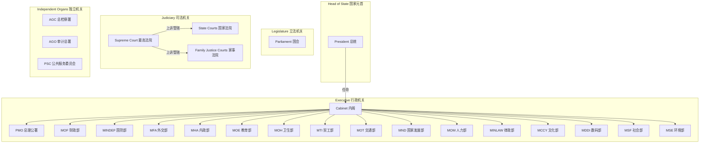
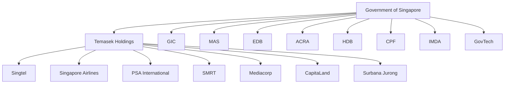
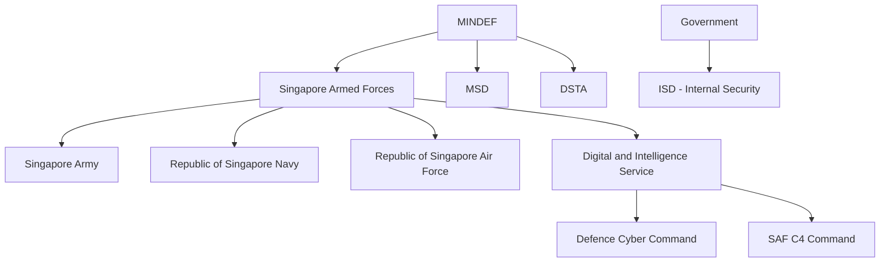
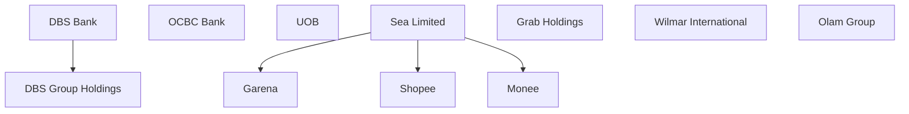
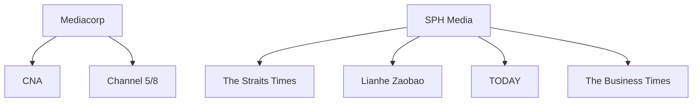
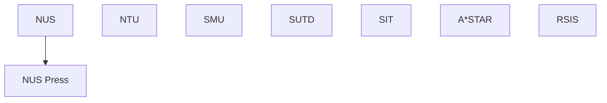

# Singapore Organization Knowledge Graph

## State Power Structure (国家权力架构)

## Government & SOE Hierarchy

## Military & Security Structure

## Financial & Corporate Sector

## Media Ecosystem

## Academic & Research

## Legend

| Category | Color |
|----------|-------|
| GOV - Government | Blue |
| SOE - State-Owned Enterprise | Green |
| CORP - Corporate | Orange |
| FIN - Financial | Gold |
| ACAD - Academic | Purple |
| MEDIA - Media | Red |
| MIL - Military | Dark Gray |
| NGO - Non-Government | Teal |
| INTL - International | Cyan |
| PARTY - Political Party | Brown |
